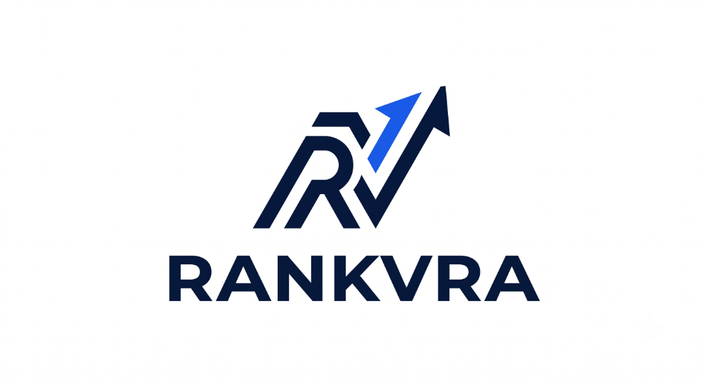
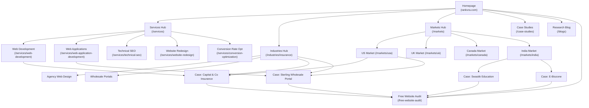

<div align="center">

  

  # RankVRA™ — Web Engineering, Software & Digital Growth
  ### High-Performance Web Applications, Commercial Web Design & Technical Search Architecture

  <p align="center">
    <strong>India-Based Engineering • Serving Clients Across the USA, UK, Canada, India & Worldwide</strong>
  </p>

  <p align="center">
    <a href="https://www.rankvra.com/"></a>
    <a href="https://www.rankvra.com/free-website-audit"></a>
    <a href="https://github.com/lwavee/rankvra"></a>
  </p>

  <p align="center">
    
    
    
    
    
    
    
  </p>

</div>

---

## 📑 Table of Contents

1. [Executive Summary & Commercial Positioning](#-executive-summary--commercial-positioning)
2. [Core Service Pillars](#-core-service-pillars)
3. [Verified Production Case Studies](#-verified-production-case-studies)
4. [Industry Authority: Insurance Architecture](#-industry-authority-insurance-architecture)
5. [National & International Market Hubs](#-national--international-market-hubs)
6. [Complete Codebase Architecture ("All Stature")](#-complete-codebase-architecture-all-stature)
7. [Technical SEO & Search Engineering](#-technical-seo--search-engineering)
8. [Information Architecture & Crawl Graph](#-information-architecture--crawl-graph)
9. [Leadership & Engineering Team](#-leadership--engineering-team)
10. [Local Development & Deployment Guide](#-local-development--deployment-guide)
11. [Ethical SEO Standards & Guarantees](#-ethical-seo-standards--guarantees)

---

## 🎯 Executive Summary & Commercial Positioning

**RankVRA** is an India-based full-stack web engineering, custom application development, and search architecture company. We engineer sub-second web platforms, enterprise broker portals, and commercial organic search engines for forward-thinking organizations across **India, the United States, the United Kingdom, Canada**, and other international markets.

### The Problem We Solve
Most corporate websites suffer from three debilitating issues:
1. **CMS Bloat & Fragility**: Monolithic WordPress installations weighed down by 40+ third-party plugins that collapse under load, take 5–8 seconds to render on mobile devices, and fail Google Core Web Vitals.
2. **Vanity Traffic vs. Commercial Failure**: SEO retainers that report arbitrary ranking spikes on zero-intent keywords without producing a single qualified phone call, RFQ, or booked demo.
3. **Disjointed Agency Handoffs**: Agencies that outsource development to inexperienced freelancers while account managers insulate technical leadership from direct client collaboration.

### The RankVRA Standard
- **Clean Next.js & React 19 Architecture**: Server-Side Rendering (SSR), Static Site Generation (SSG), and edge-cached delivery ensure lightning-fast first contentful paint (FCP) and zero cumulative layout shift (CLS).
- **Engineering-Led Search Systems**: Structured Schema.org entity graphs, crawl budget optimization, clean URL hierarchies, and topical clusters that capture verified commercial search intent.
- **Direct Founder Engagement**: Work directly with Lead Technical Architect **Naveen Panchal** and senior engineers.

---

## ⚡ Core Service Pillars

```
                        ┌─────────────────────────────────────┐
                        │              RankVRA                │
                        │    Commercial Service Portfolio     │
                        └──────────────────┬──────────────────┘
                                           │
         ┌─────────────────────────────────┼─────────────────────────────────┐
         ▼                                 ▼                                 ▼
┌──────────────────┐             ┌──────────────────┐             ┌──────────────────┐
│ Web Engineering  │             │ Search & SEO     │             │ Growth Systems   │
├──────────────────┤             ├──────────────────┤             ├──────────────────┤
│• Web Development │             │• Technical SEO   │             │• Conversion (CRO)│
│• Website Design  │             │• International   │             │• Landing Pages   │
│• Web Redesign    │             │• Commercial SEO  │             │• Inbound Funnels │
│• Custom Web Apps │             │• Schema Graphs   │             │• Quote Portals   │
│• eCommerce (D2C) │             │• Crawl Audit     │             │• B2B Dashboards  │
└──────────────────┘             └──────────────────┘             └──────────────────┘
```

### 1. Web Development ([`/services/web-development`](https://www.rankvra.com/services/web-development))
- High-performance corporate websites and digital platforms built on Next.js, React, TypeScript, and modern CSS.
- Zero reliance on brittle page builders or render-blocking plugins.
- Built-in edge caching, responsive typography, and mobile-first layout stability.

### 2. Website Design & UI/UX ([`/services/website-design`](https://www.rankvra.com/services/website-design))
- Conversion-oriented interface design tailored to executive decision-makers and high-ticket B2B buyers.
- Clean visual hierarchies, accessible contrast ratios, and interactive micro-animations.

### 3. Website Redesign & SEO Preservation ([`/services/website-redesign`](https://www.rankvra.com/services/website-redesign))
- Comprehensive legacy modernization for outdated corporate web properties.
- **Strict SEO Preservation Protocol**: Complete 1:1 URL mapping, 301 redirect architecture, and backlink equity preservation to prevent traffic drops during migration.

### 4. Custom Web Application Development ([`/services/web-application-development`](https://www.rankvra.com/services/web-application-development))
- Bespoke internal business tools, client intake portals, SaaS MVPs, and role-based operational dashboards.
- Secure API integrations, role-based access control (RBAC), and automated database workflows.

### 5. Technical SEO & Core Web Vitals ([`/services/technical-seo`](https://www.rankvra.com/services/technical-seo))
- Deep architectural audit covering TTFB, LCP, INP, CLS, rendering strategy, crawl budget efficiency, canonical consistency, and structured data validation.

### 6. International SEO Architecture ([`/services/international-seo`](https://www.rankvra.com/services/international-seo))
- Multi-market search strategy covering geo-targeting, CDN edge latency reduction, multi-region entity building, and international commercial search intent.

### 7. Conversion Rate Optimization (CRO) ([`/services/conversion-optimization`](https://www.rankvra.com/services/conversion-optimization))
- Frictionless quote intake funnels, strategic form placement, value hierarchy re-engineering, and verifiable conversion rate improvements.

### 8. eCommerce Development ([`/services/ecommerce-development`](https://www.rankvra.com/services/ecommerce-development))
- Custom, headless Next.js shopping engines, instant checkout pathways, and B2B wholesale order catalogs designed to outpace slow marketplace templates.

### 9. Landing Page Development ([`/services/landing-page-development`](https://www.rankvra.com/services/landing-page-development))
- Dedicated campaign landing pages engineered for 1:1 message match with Google Ads and LinkedIn paid search campaigns, eliminating distraction leaks.

---

## 🏆 Verified Production Case Studies

We distinguish between simulated marketing templates and real production software. Every case study features verified technical implementations and destination verification.

| Client / System | Market | Sector | Deliverables | Architecture | Live Verification |
|:---|:---:|:---:|:---|:---|:---:|
| **Capital & Co Insurance Services** | 🇺🇸 United States | Commercial Insurance | Brokerage web design, quote funnels, policyholder UX | Next.js, TypeScript, Tailwind | [Visit Live Site ↗](https://capcoinsurance.com/) |
| **Sterling Wholesale Insurance** | 🇺🇸 United States | Wholesale Surplus Lines | Custom broker intake portal, multi-file intake, RBAC | Custom Next.js Portal, REST API | [Visit Live Portal ↗](https://app.sterlingwholesaleinsurance.com/) |
| **Swastik Computer Education** | 🇮🇳 India | EdTech / Academics | Academic portal, certificate verification database | Next.js, Node.js, SQL DB | *Production Certified* |
| **E-Biozone** | 🇮🇳 India | Laboratory Equipment | Scientific instrument catalog, B2B RFQ intake system | Next.js, Headless Catalog | *Production Certified* |

---

## 🛡️ Industry Authority: Insurance Architecture

RankVRA holds verified domain experience engineering software and web systems for the commercial insurance industry. Explore our dedicated insurance pillar:

👉 **[`https://www.rankvra.com/industries/insurance`](https://www.rankvra.com/industries/insurance)**

### What We Engineer for Insurance:
1. **Commercial Insurance Agency Web Design**: Independent agency platforms engineered to capture middle-market business insurance accounts (GL, Commercial Property, Workers' Comp, Cyber).
2. **Wholesale Broker Submission Portals**: Secure multi-state submission systems allowing retail agents to upload ACORD forms, loss runs, and statement of values (SOVs) with automated routing.
3. **Policyholder Quote Funnels**: Streamlined intake flows that qualify underwriting criteria and boost inbound submission completion rates.
4. **Agency Management System (AMS) Integrations**: Clean webhook connections to bridge website submissions into Applied Epic, AMS360, HawkSoft, or custom CRM pipelines.

---

## 🌍 National & International Market Hubs

RankVRA delivers software engineering and technical SEO to businesses worldwide. Every market hub provides detailed context on operational overlap, regulatory compliance, and cross-border workflows:

```
                                  RankVRA Global Delivery
                                             │
      ┌──────────────────┬───────────────────┼───────────────────┬──────────────────┐
      ▼                  ▼                   ▼                   ▼                  ▼
┌───────────┐      ┌───────────┐       ┌───────────┐       ┌───────────┐      ┌───────────┐
│  🇺🇸 USA   │      │  🇬🇧 UK    │       │ 🇨🇦 Canada │       │ 🇮🇳 India  │      │ 🇮🇳 Delhi  │
│  Market   │      │  Market   │       │  Market   │       │ National  │      │    NCR    │
├───────────┤      ├───────────┤       ├───────────┤       ├───────────┤      ├───────────┤
│• EST/PST  │      │• GMT/BST  │       │• PIPEDA   │       │• Pan-India│      │• Gurgaon  │
│  Overlap  │      │  Overlap  │       │• Bilingual│       │• Mumbai   │      │• Noida    │
│• USD Wire │      │• GDPR/ICO │       │• CAD Wire │       │• Bangalore│      │• Delhi HQ │
│• Case:    │      │• Edge CDN │       │• Canadian │       │• Tech HQs │      │• Corporate│
│  Cap & Co │      │  Speed    │       │  Portals  │       │  & SaaS   │      │  Platforms│
└───────────┘      └───────────┘       └───────────┘       └───────────┘      └───────────┘
```

- **[United States (`/markets/usa`)](https://www.rankvra.com/markets/usa)**: US commercial expectations, EST/PST business hours overlap, verified US insurance case studies.
- **[United Kingdom (`/markets/uk`)](https://www.rankvra.com/markets/uk)**: UK corporate platforms, GDPR compliance, European edge CDN routing, GMT meeting alignment.
- **[Canada (`/markets/canada`)](https://www.rankvra.com/markets/canada)**: Canadian commercial websites, PIPEDA compliance, bilingual-ready architecture.
- **[India National (`/markets/india`)](https://www.rankvra.com/markets/india)**: Enterprise web engineering for high-growth firms across Mumbai, Bengaluru, Hyderabad, Jaipur, and Pune.
- **[Delhi NCR (`/markets/delhi-ncr`)](https://www.rankvra.com/markets/delhi-ncr)**: High-speed corporate websites, B2B lead generation, and custom web applications for Gurgaon, Noida, and South Delhi enterprises.

---

## 📂 Complete Codebase Architecture ("All Stature")

Below is the directory map of the RankVRA codebase:

```
rankvra/
├── app/                                       # Next.js 16 App Router Root
│   ├── layout.tsx                             # Root HTML Layout, Metadata & Schema Graph
│   ├── page.tsx                               # Homepage (Hero, Bento Grid, Case Studies)
│   ├── not-found.tsx                          # Semantic 404 Rescue Hub
│   ├── robots.ts                              # Robots.txt Generation (Disallow admin/thank-you)
│   ├── sitemap.ts                             # Dynamic XML Sitemap (All 79 canonical routes)
│   │
│   ├── components/                            # Reusable UI & Section Components
│   │   ├── site-shell.tsx                     # Header Navigation, Mobile Drawer & Global Footer
│   │   ├── VisitorTracker.tsx                 # Edge Analytics Tracker
│   │   ├── home/                              # Homepage Sections
│   │   │   ├── hero-section.tsx               # Terminal HUD, International Positioning
│   │   │   ├── services-section.tsx           # Bento Grid of Core Offerings
│   │   │   ├── results-section.tsx            # Genuine Case Studies Grid (Capital & Co, etc.)
│   │   │   ├── why-rankvra-section.tsx        # Engineering Standards vs. Legacy Agencies
│   │   │   ├── latest-blogs-section.tsx       # Curated Technical & SEO Publications
│   │   │   └── cta-section.tsx                # High-Intent Free Audit CTA
│   │   ├── services/                          # Specialized Service Sub-Components
│   │   │   ├── web-dev-hero.tsx               # Interactive Web Dev Terminal
│   │   │   └── seo-hero.tsx                   # SEO Graph & Crawl Matrix Console
│   │   ├── about-page.tsx                     # Leadership, Origins & Founder Profile
│   │   └── contact-page.tsx                   # Global Inbound Inquiry Hub
│   │
│   ├── services/                              # Core Commercial Service Hierarchy
│   │   ├── page.tsx                           # Services Index Hub
│   │   ├── web-development/                   # Primary Commercial Service
│   │   ├── website-design/                    # UI/UX & Brand Architecture
│   │   ├── website-redesign/                  # 301 Redirect Protocol & Modernization
│   │   ├── web-application-development/       # Custom Portals, Dashboards & SaaS
│   │   ├── technical-seo/                     # Core Web Vitals & Crawl Optimization
│   │   ├── international-seo/                 # Multi-Region Search Strategy
│   │   ├── conversion-optimization/           # Quote Intake & Funnel Optimization
│   │   ├── ecommerce-development/             # Headless & Next.js eCommerce
│   │   ├── landing-page-development/          # High-Converting Campaign Pages
│   │   └── seo/                               # Holistic Search Strategy
│   │
│   ├── industries/                            # Industry Authority Pillar Hubs
│   │   ├── insurance/                         # Insurance Agency Web Design & Portals
│   │   ├── clinics/                           # Healthcare & Clinical Systems
│   │   ├── exporters/                         # International Trade & Manufacturing
│   │   └── hotels/                            # Direct Booking Platforms
│   │
│   ├── markets/                               # National & Global Geographic Hubs
│   │   ├── page.tsx                           # Global Delivery Overview
│   │   ├── usa/                               # US Business Web Engineering
│   │   ├── uk/                                # UK Corporate Platforms & GDPR
│   │   ├── canada/                            # Canadian Web Architecture & PIPEDA
│   │   ├── india/                             # Pan-India Enterprise Systems
│   │   └── delhi-ncr/                         # Gurgaon, Noida & Delhi B2B Platforms
│   │
│   ├── case-studies/                          # Case Studies Subsystem
│   │   ├── page.tsx                           # Case Studies Gallery
│   │   ├── [slug]/page.tsx                    # Dynamic Case Study Reader + JSON-LD Schema
│   │   └── data.ts                            # Verified Case Study Data Model
│   │
│   ├── blogs/                                 # Technical Publication Engine
│   │   ├── page.tsx                           # Blog Index & Search
│   │   ├── [slug]/page.tsx                    # In-Depth Research Article Reader
│   │   └── data.ts                            # 20 Long-Form Architectural Blueprints
│   │
│   ├── free-website-audit/                    # Dedicated Conversion Funnel
│   │   ├── page.tsx                           # Technical Audit Intake Form
│   │   └── layout.tsx                         # Canonical Meta Definition
│   │
│   ├── contact/                               # Inbound Contact Page
│   ├── about/                                 # About Company & Founder
│   ├── portfolio/                             # Portfolio Index
│   ├── privacy-policy/                        # Legal Privacy Policy
│   ├── terms-and-conditions/                  # Commercial Terms
│   ├── thank-you/                             # Form Submission Confirmation (Noindex)
│   │
│   ├── api/                                   # Serverless API Handlers
│   │   ├── lead/route.ts                      # Inbound Audit & Lead Capture Handler
│   │   ├── visit/route.ts                     # Telemetry & Visitor Logging
│   │   ├── blogs/route.ts                     # Blog Query API
│   │   └── reels/route.ts                     # Social Video Feed Handler
│   │
│   └── radhe-radhe-admin/                     # Secure Administrative Console (Disallowed)
│       ├── login/
│       ├── dashbord/
│       ├── leads/
│       ├── blogs/
│       └── reels/
│
├── public/                                    # Public Static Assets
│   ├── logo.png                               # Primary Brand Mark
│   ├── logo-full.png                          # Full Horizon Brand Mark
│   ├── ceo-naveen.png                         # Verified Founder Headshot
│   ├── favicon.ico                            # Browser Tab Favicon
│   └── images/blogs/                          # 20 Semantic SVG Illustrations
│       ├── core-web-vitals-nextjs.svg
│       ├── b2b-lead-generation-india.svg
│       ├── ecommerce-seo-india.svg
│       └── ...
│
├── next.config.ts                             # Next.js Runtime, Image Domains & Security Headers
├── tailwind.config.ts                         # Tailwind CSS Tokens, Modern Fonts & Gradients
├── tsconfig.json                              # TypeScript Compiler Configuration
└── package.json                               # Dependencies & Build Scripts
```

---

## 🔍 Technical SEO & Search Engineering

### 1. Schema.org Entity Graph Architecture
We inject connected JSON-LD structured data on all pages using the `@graph` standard:
```json
{
  "@context": "https://schema.org",
  "@graph": [
    {
      "@type": "Organization",
      "@id": "https://www.rankvra.com/#organization",
      "name": "RankVRA",
      "url": "https://www.rankvra.com",
      "logo": "https://www.rankvra.com/logo.png",
      "founder": {
        "@type": "Person",
        "@id": "https://www.rankvra.com/#founder",
        "name": "Naveen Panchal"
      },
      "areaServed": [
        { "@type": "Country", "name": "United States" },
        { "@type": "Country", "name": "United Kingdom" },
        { "@type": "Country", "name": "Canada" },
        { "@type": "Country", "name": "India" }
      ]
    },
    {
      "@type": "WebSite",
      "@id": "https://www.rankvra.com/#website",
      "url": "https://www.rankvra.com",
      "name": "RankVRA",
      "publisher": { "@id": "https://www.rankvra.com/#organization" }
    }
  ]
}
```

### 2. Single Canonical Standard
All routes strictly self-canonicalize to `https://www.rankvra.com` (HTTPS, non-www, lowercase, zero trailing slashes).

### 3. XML Sitemap & Robots Protocol
- **Sitemap**: Generated dynamically via `app/sitemap.ts` at `/sitemap.xml`. Covers all canonical service pages (`0.90`), industry pillars (`0.90`), genuine case studies (`0.85`), market hubs (`0.80`), and blog blueprints (`0.75`).
- **Robots.txt**: Generated via `app/robots.ts` at `/robots.txt`. Grants full crawl access to Googlebot while blocking private API endpoints (`/api/`), administrative routes (`/radhe-radhe-admin/`), and post-conversion pages (`/thank-you`).

---

## 🌐 Information Architecture & Crawl Graph



---

## 👨‍💻 Leadership & Engineering Team

<div align="left">
  <table>
    <tr>
      <td width="160" align="center" valign="top">
        
      </td>
      <td>
        <h3>Naveen Panchal (<a href="https://github.com/lwavee">@lw_avee</a>)</h3>
        <p><strong>Founder, CEO & Lead Technical Architect</strong></p>
        <p>
          Full-stack software engineer, technical SEO architect, and educator. Naveen founded RankVRA with an engineering-first philosophy: build sub-second Next.js web applications, clean algorithmic search architectures, and verifiable B2B lead funnels that compete and win in any market worldwide.
        </p>
        <p>
          <a href="https://github.com/lwavee"><strong>GitHub</strong></a> •
          <a href="https://www.youtube.com/@Lw_avee"><strong>YouTube</strong></a> •
          <a href="https://www.instagram.com/lw_avee/"><strong>Instagram</strong></a> •
          <a href="https://www.facebook.com/lwavee"><strong>Facebook</strong></a>
        </p>
      </td>
    </tr>
  </table>
</div>

---

## 💻 Local Development & Deployment Guide

### Prerequisites
- **Node.js**: `v20.x` or higher
- **Package Manager**: `npm` (v10+), `pnpm`, or `yarn`
- **Git**: Installed and configured

### 1. Clone the Repository
```bash
git clone https://github.com/lwavee/rankvra.git
cd rankvra
```

### 2. Install Dependencies
```bash
npm install
```

### 3. Start the Development Server
```bash
npm run dev
```
Open [http://localhost:3000](http://localhost:3000) in your browser to inspect the application with live hot-reloading powered by Turbopack.

### 4. Type Checking & Production Build Validation
```bash
# Verify zero TypeScript compile errors
npx tsc --noEmit

# Execute Next.js production build & static generation
npm run build
```

Expected build output:
```
✓ Compiled successfully
✓ Generating static pages (79/79)
✓ Finalizing page optimization
```

### 5. Production Deployment
This repository is optimized for deployment on **Vercel**, **AWS Amplify**, or any Node.js containerized environment (Docker / Cloud Run):
- Connect the GitHub repository `lwavee/rankvra` to Vercel.
- Framework preset: **Next.js**.
- Build command: `npm run build`.
- Output directory: `.next`.

---

## ⚖️ Ethical SEO Standards & Guarantees

RankVRA operates in strict adherence to **Google Search Essentials** and algorithmic quality guidelines:
- **Zero Black-Hat SEO**: No Private Blog Networks (PBNs), automated link spam, hidden text, keyword stuffing, or doorway pages.
- **Zero Fabricated Claims**: No artificial transaction tickers, fake customer counts, or unverified performance metrics.
- **Zero Fake Reviews**: Every case study represents genuine technical software and engineering work with verifiable destination links.
- **Long-Term Asset Value**: We build sustainable technical foundations and commercial authority that withstand Google core algorithm updates.

---

<div align="center">
  <p>
    <strong>RankVRA™</strong> — Engineered for Commercial Performance.
  </p>
  <p>
    <a href="https://www.rankvra.com/">Home</a> •
    <a href="https://www.rankvra.com/services">Services</a> •
    <a href="https://www.rankvra.com/industries/insurance">Insurance</a> •
    <a href="https://www.rankvra.com/case-studies">Case Studies</a> •
    <a href="https://www.rankvra.com/markets">Markets</a> •
    <a href="https://www.rankvra.com/blogs">Publications</a> •
    <a href="https://www.rankvra.com/free-website-audit">Free Website Audit</a> •
    <a href="https://www.rankvra.com/contact">Contact</a>
  </p>
  <p>
    <sub>© 2026 RankVRA. All rights reserved. Built with Next.js, React 19 & TypeScript.</sub>
  </p>
</div>
